# Game of "Rock Paper Scissors Lizzard Spok"

The game of "Rock Paper Scissors Lizzard Spok" is based on a traditional game of "Rock Paper Scissors" but with some new options to choose from to make the game more interesting.

On this website user can play the game against a computer, which is based purely on your luck, as computer selects the options randomly and there is no way to predict what computer will select next. Whoever gets the 5 points first wins the game!

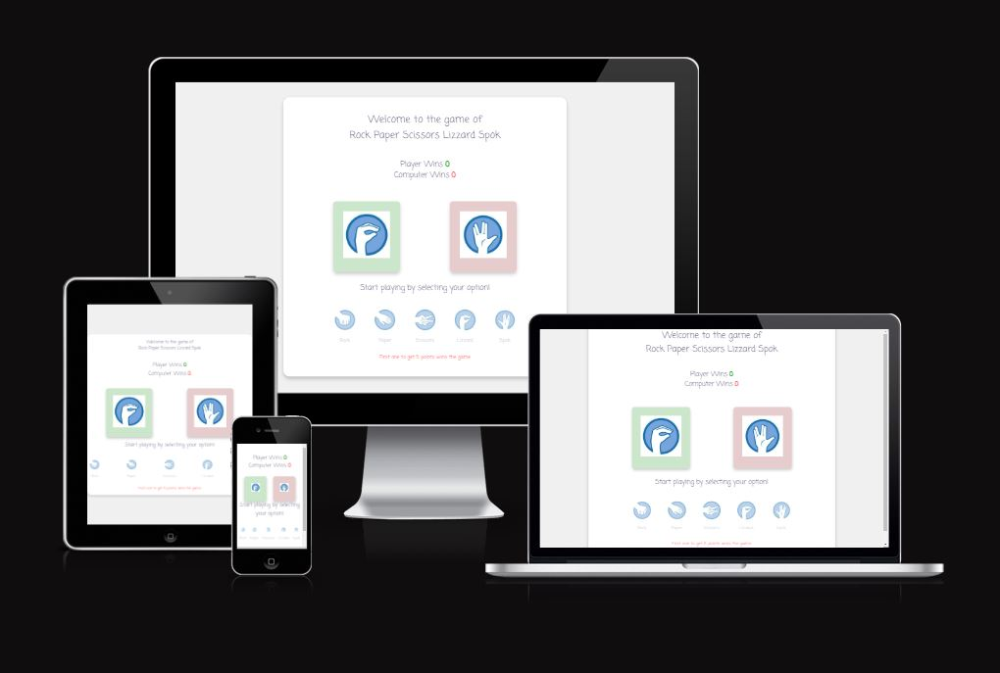

## Features

This section is describing all the existing features available on the page

* **Heading**

-A simple heading greating user to the game of "Rock Paper Scissors Lizzard Spok"

-This section will welcome the player and tell them the name of the game

* **Score Counter**

-Score Counter keeps track of player's and computer's points after each match. If player wins they get 1 point, if player looses computer gets 1 point, and if its a draw no one gets a point

-This section will help user to keep a track of the score the game to see who is winning

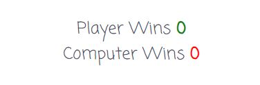

* **Selections**

-It shows the icon of the player's option and the icon of computer's randomly selected objects

-It will help player visually after each match to see what the selected options are. Also, to make it easier for a player, I matched the background of selections with the color of score counters: green for player's selection and red for computer's selection.

* **Player Options**

-Before the game starts it consists of the message asking player to pick the first option, and then, after each match, this message will be replaced with the text saying the results of the match, if its "Win", "Loose", or a "Draw". Underneath the text player can see the icons for all the options available and whenever player clicks on the icon it will be their option fot the next match

-This is the main section for the gameplay as it gives the player information on how to start the match and what was the outcome of the match, as well as it allows player to select the option for each match

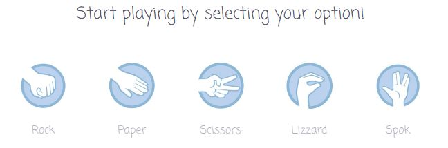

* **Rules**

-Simple paragraph explaining to user when the game will be over

-It will notify the player about the rules of the game, when someone reaches 5 Wins the game will be over

* **Game Finished Message**

-Alert message notifying the player that they Won/Lost the game. Once player clicks OK on the alert message the page will refresh and player can start a new game

-Depending on the outcome of the game player will receive the message saying that they won or they lost the game, and after they click OK the page will refresh automatically. So, if player wants to start a new game they don't have to refresh the page manually

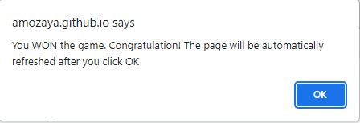

## Testing

In this section I did some of the automated and manual tests in order to ensure that project is working correctly.

### Validator Testing

* **HTML**

-First, using W3C Validator I received an error saying it's not allowed to use `
` element inside ``:

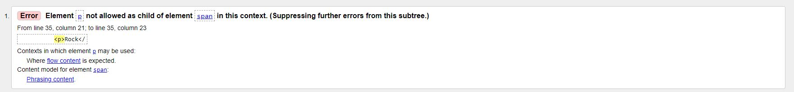

After this error I've decided to change my code and replaced all `
` elements inside the `` with another ``:

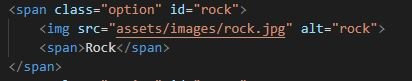

-Another warning I received after using W3C Validator  is the suggestion to use headings for <section> elements:

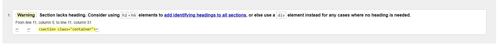

I didn't use any `H1` elements for headings in this project, but instead I used `
` element with `
` inside it as my heading:

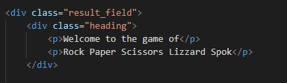

-And at the end the only message I received from W3C Validator is a warning about headings:

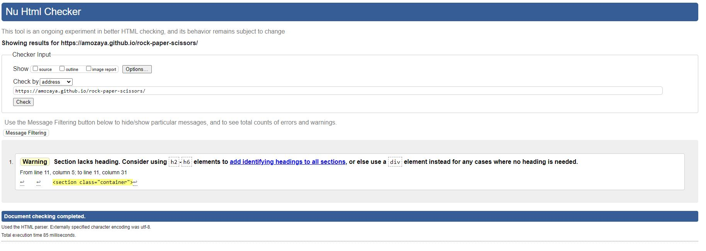

* **CSS**

-I tested my website on CSS Validator and my code got approved:

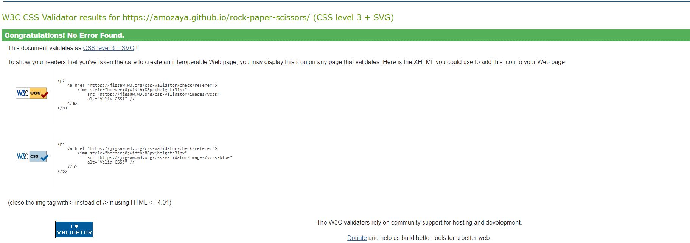

* **JSHint**

-I used JSHint Validator to check the JavaScript for errors. No erros were returned. The following metrics were returned:
  * There are 9 functions in this file.
  * Function with the largest signature take 2 arguments, while the median is 0.
  * Largest function has 21 statements in it, while the median is 2.
  * The most complex function has a cyclomatic complexity value of 8 while the median is 1.

### Manual Testing

In this section I did some manual testing, using mobile device, to ensure that website is responsive and adapts to different screen sizes.

* **Sony mobile phone**

-I used my Sony Xperia 1ii mobile phone in order to test my website on a smaller screen. Phone operates on Android 12 and uses Chrome browser:

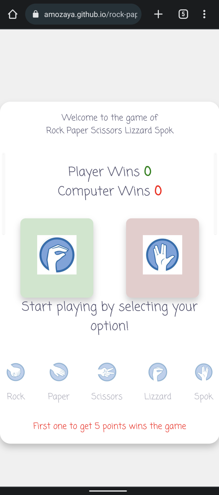

-Here is a screenshot of the "Game lost" message after I lost the game:

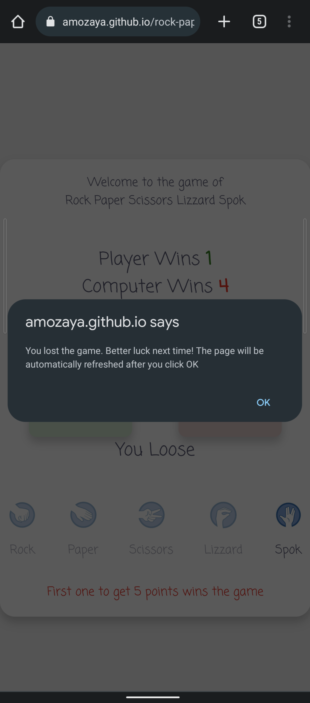

## Deployment

The site was deployed to GitHub pages. The steps to deploy are as follows: 
  - In the GitHub repository, navigate to the Settings tab 
  - From the source section drop-down menu, select the Master Branch
  - Once the master branch has been selected, the page will be automatically refreshed with a detailed ribbon display to indicate the successful deployment. 

The live link can be found here - https://amozaya.github.io/rock-paper-scissors/

## Credits

**Content**

* For inspiration and guidance for this project I used a <a href="https://www.youtube.com/watch?v=RC7NbjwP3QA">Youtube Tutorial</a>
* Instructions on how to implement a page refresh with JavaScript I found on <a href="https://stackoverflow.com/questions/2787679/how-to-reload-page-every-5-seconds">StockOverflow</a>

**Media**
* The icons for the game options I got from <a href="https://steamcommunity.com/sharedfiles/filedetails/?id=798194678"> Steam </a>

